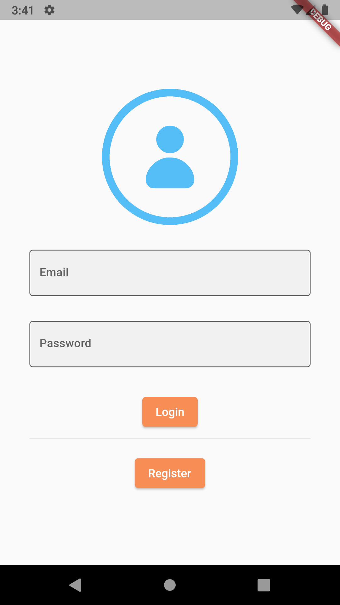

# VanTypesApp

A VanTypesApp alkalmazás az "AI: Kép alapú furgon típus meghatározás" szakdolgozat témához készült.

A szakdolgozatom során olyan mobilalkalmazást kell megvalósítanom, ami képes mesterséges intelligencia modellt felhasználva furgonokat észlelni és azoknak a típusait  megállapítani képekről. Az applikációhoz használt modell saját magam által betanított. Jelenleg négy típus támogatott (sima, platós, dobozos furgon és minibusz).

A modellhez az előre betanított SSD MobileNet V2 modell-t használtam, amely betanítása Google Colab segítségével történt. Az elkészített modell is továbbfejleszthető, illetve 
más kutatási célokhoz is felhasználható. Az applikáción belül mesterséges intelligencia kezeléséről a TensorFlow Lite gondoskodott.

Az applikációban három Firebase Szolgáltatás is igénybe lett véve. Firebase Storage gondoskodik a képek mentéséről, Firebase Authentication az authentikációról, Cloud Firestore segítségével pedig a képekhez tartozó információk tárolódnak.

# Alkalmazás Müködése

Az alkalmazás elindításakor egy bejelentkezési képernyő fogad minket. Szükség van a felhasználói profilra, mivel képeket lehet feltölteni és kedvelni, így beazonosíthatók és menthetők a feltöltések és a kedvelések. Ha nincs még profilunk akkor a regisztrációs oldalon létrehozhatunk egyet.

 

Sikeres bejelentkezés vagy regisztráció után a kezdőoldal fogad minket. A kezdőoldalon alapértelmezetten a legnépszerűbb furgon képek jelennek meg, de átállíthatjuk a legfrissebbekre is. Mivel az adatbázisban rengeteg kép szerepelhet, ezért  nem lenne a legjobb megoldás egyből az összes képet lekérni, ezért 
alkalmaztam paginációt. A képeket kedvelhetjük és kikedvelhetjük a szivecske gomb megnyomására. 

 

A detekciós oldal a navigációs sáv második eleme. Ezen az oldalon tudunk furgonokat észlelni. A képet készíthetjük a kameránkkal vagy választhatunk a gallériánkból. Mind a két opcióhoz engedélyek szükségesek, ezek kezelve vannak. Kép megadása után megkezdődik az észlelés, majd az eredmény a képen megtekinthető.

 

Az észlelés eredménye alatt két gomb is megjelenik. Itt tudjuk újrakezdeni a detektálást, illetve itt van opciónk feltölteni a képet az adatbázisba (feltéve ha történt észlelés).

 

A következő Galéria fülön kategória alapján tudjuk böngészni a furgonokat. Mindegyik furgon típushoz egy külön gomb tartozik, rákoppintva valamelyikre az adott típus képei jelennek meg az adatbázisból.

 

Az utolsó fül a kedvencek. Ezen az oldalon az általunk kedvelt és általunk feltöltött képek találhatóak meg. Törölni az általunk feltöltött képet a kukára kattintva tudjuk. A kedvelés / kikedvelés és a feltöltés / törlés is reszponzív, ami annyit jelent, hogy az alkalmazásban bekövetkezett eseményekre ezek az elemek is frissülnek.

 

Az alkalmazás Drawer-ja tartalmazza a felhasználónevet, illetve itt lehet témát, nyelvet választani.
Világos és sötét téma áll rendelkezésre, ezt a csúszkával változtathatjuk meg. Az applikáció megjegyzi az utóljára használt témát, így annak újbóli elindításával a megjegyzett témával indul el.
Nyelv közül a magyar és az angol támogatott.

 
